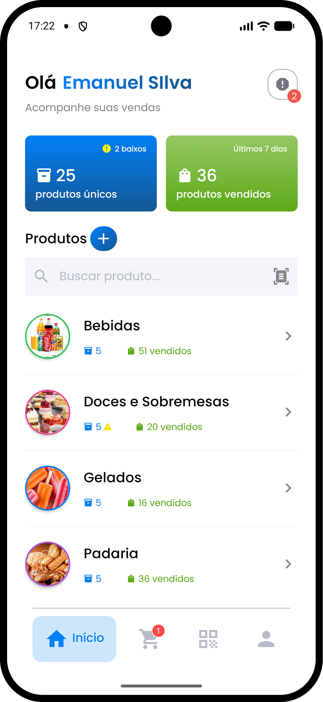
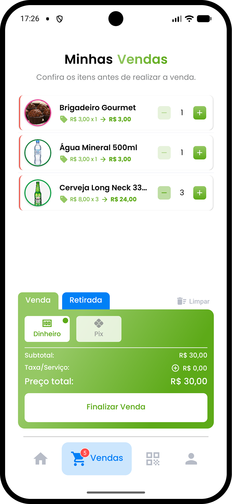
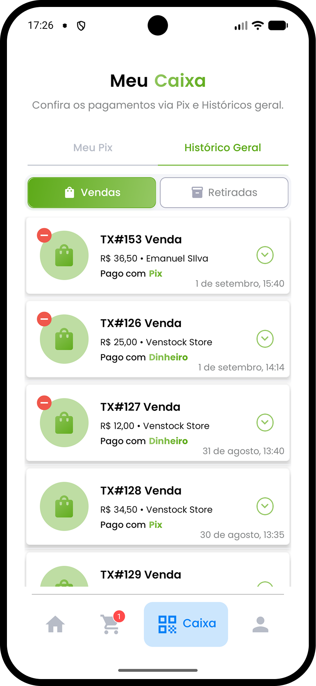

# 📦 Venstock

<p align="center">
  
  
  
  
  

  

  <a href="https://github.com/emanuelhenrique-dev/venstock-app/commits/master">
    
  </a>

  <a href="https://github.com/emanuelhenrique-dev/venstock-app/issues">
    
  </a>
</p>

<p align="center">
  
</p>

Venstock é um aplicativo mobile para pequenos comércios gerenciarem estoque, vendas, produtos e receitas com dados salvos localmente.

## 🚀 Visão geral

O app foi desenvolvido para comerciantes que precisam de controle rápido e confiável do estoque e das vendas:

- Cadastro de categorias e produtos
- Ajuste de estoque e mínimo de reposição
- Registro de vendas e retiradas
- Busca por nome, código de barras e categoria
- Notificações locais para alertas de estoque baixo e carrinho
- Estatísticas e ranking de produtos mais vendidos
- Exportação e importação de dados de backup (JSON)

## 🧠 Tecnologias usadas

- React Native
- Expo SDK 54
- Expo Router
- TypeScript
- SQLite
- AsyncStorage
- Expo Notifications, Camera, Image Picker e sharing , etc
- React Native SVG e QRCode
- Zustand para estado global

## 📦 Funcionalidades atuais

- Cadastro, edição e exclusão de categorias
- Cadastro e edição de produtos com imagem, cor, descrição, código de barras e categoria
- Ajuste manual de estoque e mínimo de estoque
- Registro de transações de venda e retirada
- Visualização de histórico e exclusão de transações recentes
- Busca de produtos por nome ou código e filtro por estoque baixo
- Exibição de produtos categorizados e ranking dos produtos mais vendidos
- Notificações de estoque baixo e lembretes de carrinho
- Persistência offline usando SQLite

## 🧱 Estrutura do projeto

- `src/app/`: telas e rotas do Expo Router
- `src/components/`: componentes reutilizáveis como cards, formulários e scanner
- `src/database/`: hooks de acesso a SQLite para categorias, produtos e transações
- `src/hooks/`: hooks personalizados para autenticação, notificações e lembretes
- `src/services/`: lógica de alertas de estoque e notificações locais
- `src/store/`: estado global do carrinho com `zustand`
- `src/theme/`: cores, tipografia e estilos globais

## 📥 Como rodar

```bash
npm install
npm run android
```

## 💡 Observações

- O Venstock funciona offline, mantendo os dados salvos no dispositivo.
- A navegação é feita com Expo Router.
- O app usa câmera e galeria para imagens de produtos e perfil.
- O banco de dados local é gerenciado via SQLite.
- Pretendo fazer uma v2 com banco de dados online.

## 📝 Aprendizados

- Armazenamento local com SQLite e migrações
- Exportação, importação e preservação de integridade relacional em backups JSON
- Tratamento de dados legados e compatibilidade retroativa no banco de dados
- Formulários de produto com validações e captura de imagem
- Navegação moderna com Expo Router
- Integração com notificações nativas e permissões de dispositivo
- Estatísticas de vendas, gráficos interativos e análise de estoque em tempo real

<p align="center">
  
  
</p>
